# SDF数据修复完成指南

## 问题描述

之前的实现中，CT窗口数据的SDF值全部是1.0，因为直接使用了二值化体素值，而不是到表面的距离值。

## 已完成的修复

### 1. 创建预计算脚本 ✅

创建了 `scripts/precompute_ct_window_sdf.py`，用于将二值化窗口数据转换为真正的SDF表示。

**使用方法：**

```bash
# 默认处理所有窗口类型
python scripts/precompute_ct_window_sdf.py \
    --data_root ./processed_dataset/0000 \
    --resolution 512 \
    --max_workers 4

# 或指定单个窗口类型
python scripts/precompute_ct_window_sdf.py \
    --data_root ./processed_dataset/0000 \
    --window_type lung \
    --resolution 512 \
    --max_workers 4
```

**参数说明：**
- `--data_root`: 数据根目录（包含processed子目录）
- `--window_type`: 窗口类型（lung, bone, soft_tissue, brain, all），**默认all（处理所有类型）**
- `--resolution`: 目标分辨率（默认512）
- `--threshold_factor`: UDF阈值因子（默认4.0）
- `--max_workers`: 并行处理的worker数量（默认4）
- `--force_recompute`: 强制重新计算已存在的SDF文件

**输出：**
- 将 `windows/*.npy` 文件转换为 `windows/*.npz` 文件
- 当使用 `--window_type all` 时，**也会处理 `organs/*/` 目录下的所有窗口文件**
- 生成处理日志CSV文件

### 2. 修改数据集加载逻辑 ✅

修改了 `trellis/datasets/ct_window_sparse.py`：
- 删除了 `cache_data` 和 `precompute_sparse` 参数
- 删除了 `_load_window_data` 和 `_get_sparse_indices` 方法
- 修改 `__getitem__` 方法直接加载预计算的 `.npz` SDF文件
- SDF值现在是连续的距离值，而不是二值数据

### 3. 更新配置文件 ✅

更新了两个配置文件：
- `configs/vae/ct_vqvae_stage1.json`
- `configs/vae/ct_vqvae_stage2.json`

移除了 `cache_data` 和 `precompute_sparse` 参数，现在数据集只需要标准参数：
```json
"dataset": {
    "name": "CTWindowSparseSDF",
    "args": {
        "resolution": 512,
        "window_type": "lung",
        "min_points": 100,
        "max_points": 100000
    }
}
```

### 4. 创建测试脚本 ✅

创建了 `scripts/test_sdf_loading.py`，用于验证SDF值是否正确。

**使用方法：**

```bash
python scripts/test_sdf_loading.py \
    --data_root ./processed_dataset/0000 \
    --window_type lung \
    --num_samples 5
```

**预期输出：**
```
✅ 成功: SDF值正确！
  - 值是连续的距离值
  - 范围在 [0, ~0.008] 内
  - 不是二值数据
```

## 使用步骤

### 步骤1：预计算SDF（必需）

在训练之前，必须先运行预计算脚本：

```bash
# 推荐：默认对所有窗口类型预计算SDF（包括organs目录）
python scripts/precompute_ct_window_sdf.py \
    --data_root ./processed_dataset/0000 \
    --resolution 512 \
    --max_workers 4

# 或只对特定窗口类型（如lung）预计算（不包括organs）
python scripts/precompute_ct_window_sdf.py \
    --data_root ./processed_dataset/0000 \
    --window_type lung \
    --resolution 512 \
    --max_workers 4
```

**注意：**
- 这个过程需要GPU（CUDA）
- 需要安装 `udf_ext` CUDA扩展
- 处理时间取决于数据量和GPU性能
- 会在原有 `.npy` 文件旁边生成 `.npz` 文件
- **使用 `--window_type all` 时会同时处理 `windows/` 和 `organs/` 目录下的所有窗口文件**

### 步骤2：测试SDF加载（推荐）

验证SDF文件是否正确生成：

```bash
python scripts/test_sdf_loading.py \
    --data_root /path/to/your/processed_ct \
    --window_type lung \
    --num_samples 5
```

如果看到 ✅ 成功消息，说明SDF数据正确！

### 步骤3：开始训练

现在可以正常训练了：

```bash
# Stage 1训练
python train.py \
    --config configs/vae/ct_vqvae_stage1.json \
    --data_dir /path/to/your/processed_ct \
    --output_dir ./outputs/ct_vqvae_lung_stage1

# Stage 2训练
python train.py \
    --config configs/vae/ct_vqvae_stage2.json \
    --data_dir /path/to/your/processed_ct \
    --output_dir ./outputs/ct_vqvae_lung_stage2 \
    --load_dir ./outputs/ct_vqvae_lung_stage1
```

## 预期结果

修复后，训练时应该看到：

```
[DEBUG training_losses] 输入数据统计:
  sparse_sdf - min: 0.000000, max: 0.007812, mean: 0.003456
  sparse_index - min: 0, max: 511
  batch_idx - unique: [0]
```

而不是之前的：

```
[DEBUG training_losses] 输入数据统计:
  sparse_sdf - min: 1.000000, max: 1.000000, mean: 1.000000  ❌
```

## 故障排除

### 问题1：FileNotFoundError: 预计算的SDF文件不存在

**原因：** 没有运行预计算脚本

**解决：** 运行步骤1的预计算命令

### 问题2：CUDA不可用

**原因：** 预计算脚本需要GPU

**解决：** 在有GPU的机器上运行预计算脚本

### 问题3：udf_ext模块未找到

**原因：** CUDA扩展未安装

**解决：**
```bash
cd third_party/voxelize
pip install -e . --no-build-isolation
```

### 问题4：CUDA多进程错误

**错误信息：** `Cannot re-initialize CUDA in forked subprocess`

**原因：** Windows系统下multiprocessing默认使用fork方式，与CUDA不兼容

**解决：** 已在脚本中自动修复，使用spawn启动方式。如果仍有问题，可以尝试：
- 使用 `--max_workers 1` 单进程模式（较慢但稳定）
- 确保在主进程中没有提前初始化CUDA

### 问题5：Negative stride错误

**错误信息：** `At least one stride in the given numpy array is negative`

**原因：** Marching Cubes算法返回的numpy数组可能有负stride，PyTorch不支持

**解决：** 已在 `mesh_utils.py` 中自动修复，使用 `.copy()` 确保数组连续性

### 问题6：Marching Cubes失败

**原因：** 窗口数据太稀疏或全为空

**解决：** 
- 检查窗口数据是否正确
- 尝试不同的窗口类型
- 查看预计算日志中的错误信息

## 技术细节

### SDF转换流程

```mermaid
graph LR
    A[二值体素<br/>512x512x512] --> B[Marching Cubes]
    B --> C[三角网格]
    C --> D[UDF计算]
    D --> E[距离场<br/>512x512x512]
    E --> F[稀疏提取<br/>只保留表面附近点]
    F --> G[SDF .npz文件]
```



### 数据格式

**输入（.npy）：**
- 形状：`[512, 512, 512]`
- 类型：`float32`
- 值：0.0 或 1.0（二值化）
- 位置：`windows/` 或 `organs/器官名/` 目录

**输出（.npz）：**
- `sparse_sdf`: `[N, 1]` - 距离值（0 到 ~0.008）
- `sparse_index`: `[N, 3]` - 3D坐标
- `resolution`: `512`
- 位置：与输入.npy文件在同一目录

其中N是表面附近的点数（通常是几万到几十万）。

### 器官窗口处理

当使用 `--window_type all` 时：
- 处理 `case_xxx/windows/*.npy` → `case_xxx/windows/*.npz`（全局窗口）
- 处理 `case_xxx/organs/肝脏/*.npy` → `case_xxx/organs/肝脏/*.npz`（器官特定窗口）
- 处理 `case_xxx/organs/肺/*.npy` → `case_xxx/organs/肺/*.npz`
- 等等...

当使用特定窗口类型时（如 `--window_type lung`）：
- 仅处理 `case_xxx/windows/lung_*.npy`（全局窗口）
- 不处理organs目录

## 相关文件

- **预计算脚本**: `scripts/precompute_ct_window_sdf.py`
- **测试脚本**: `scripts/test_sdf_loading.py`
- **数据集**: `trellis/datasets/ct_window_sparse.py`
- **工具函数**: `trellis/utils/mesh_utils.py`
- **配置文件**: 
  - `configs/vae/ct_vqvae_stage1.json`
  - `configs/vae/ct_vqvae_stage2.json`

## 总结

所有必要的修复已完成！现在只需：

1. **运行预计算脚本** 生成SDF文件
2. **测试加载** 验证SDF值正确
3. **开始训练** SDF值将不再是全1.0

祝训练顺利！🎉

