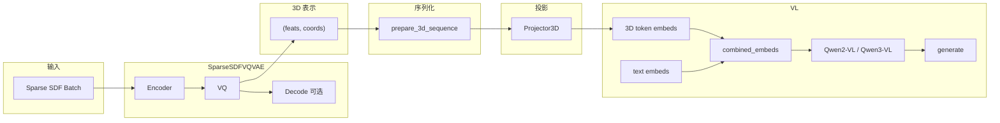

# Med-3D-LLM 项目技术文档

## 术语说明（必读）

- **「VLLM」在本文中的含义**：本项目**未使用** [vLLM](https://github.com/vllm-project/vllm) 推理库。文档中的「VLLM 部分」或「LLM 部分」均指 **Hugging Face Transformers 的 Qwen2-VL / Qwen3-VL** 以及与之对接的 3D 分支（VAE + Projector）。后文统一使用「VL 模型」或「3D-VL 分支」等表述，避免与 vLLM 库混淆。

---

## 第 1 章：项目总览与目录结构

### 1.1 项目定位

Med-3D-LLM 由两部分组成：

- **TRELLIS**：3D 生成核心，包含稀疏 SDF VQ-VAE 与扩散模型（Rectified Flow Transformers），支持从图像/文本生成多种 3D 表示（Gaussian、Radiance Field、Mesh）。
- **vae_qwen3vl**：3D→文本理解扩展。在 TRELLIS 的稀疏 SDF VQ-VAE 之上接入「冻结 VAE + Projector + Qwen2-VL/Qwen3-VL」，实现 3D 形状的编码与语言描述/问答。

即：**Med-3D-LLM = TRELLIS（3D 生成） + vae_qwen3vl（3D-VL 对齐）**。

### 1.2 顶层目录说明

| 目录/文件 | 职责 |
|-----------|------|
| **trellis/** | 核心 3D 库：models（Encoder/Decoder/VQ、扩散）、modules（稀疏卷积/Transformer）、pipelines、trainers、datasets、utils 等 |
| **vae_qwen3vl/** | 3D-VL 分支：VAE 潜变量提取、3D 序列化、Projector、Qwen2-VL/Qwen3-VL 封装、训练/评估/烟雾测试脚本 |
| **configs/** | 训练与对齐配置：vae（VQ-VAE JSON）、generation（扩散）、3d_align_train.yaml（3D-VL 统一配置）、accelerate.yaml |
| **dataset_toolkits/** | 数据集与预处理（如 CT、SDF 等格式与工具） |
| **scripts/** | 启动脚本：如 `run_3d_align_train.py` 从 YAML 加载配置并启动 accelerate 多卡 3D-VL 训练 |
| **experiment/** | 实验脚本（如 encoder_validation、重建检查、空间激活分析） |
| **outputs/** | TRELLIS VAE/扩散训练输出（ckpts、日志等） |
| **outputs_3d_align/** | 3D-VL 对齐训练输出（Projector、LoRA 等） |
| **train.py** | TRELLIS 主训练入口（`--config`、`--output_dir`、`--data_dir` 等） |
| **diffoctreerast/** | 可微八叉树光栅化子模块 |
| **third_party/** | 第三方依赖（如 voxelize） |
| **tools/** | 工具脚本（如预计算稀疏数据） |

### 1.3 关键入口与配置

- **TRELLIS VAE 训练**：`train.py`，配置来自 `configs/vae/*.json`（如 `sdf_vqvae_stage2.json`）。
- **3D-VL 对齐训练**：`scripts/run_3d_align_train.py` 或直接 `vae_qwen3vl/train_finetune.py`，统一配置为 `configs/3d_align_train.yaml`（vl_model、vae_config、vae_ckpt、data_dir、max_3d_tokens、use_lora 等）。
- **3D-VL 评估/推理**：`vae_qwen3vl/eval_3d_vl.py`，可指定 run 子目录、LoRA、数据路径等。
- **3D-VL 流程验证**：`vae_qwen3vl/run_smoke_test.py`，轻量验证 VAE Encode → codebook → Projector → VL forward/generate 与 Decode。

---

## 第 2 章：整体架构与数据流

### 2.1 架构图

从「原始 3D 数据」到「VL 生成文本」的完整数据流如下（Mermaid 图）：



### 2.2 两条主链路

**（1）训练 VAE（TRELLIS）**

- 输入：`sparse_sdf` [N, 1]、`sparse_index` [N, 3]、`batch_idx` [N]（及可选 `factor`）。
- 构造 `SparseTensor` → `SparseSDFVQVAE.forward(batch)` → `encode()` → `encoder(x, factor)` → 连续潜变量 `h` → VQ → quantized `z` → `decoder(z)` → 重建。
- 损失：重建 loss + λ_vq · vq_loss + λ_commitment · commitment_loss。

**（2）3D-VL 训练/推理**

- 同一格式的 batch → `vae.Encode(batch)` → `encoding_indices`（离散索引）→ `feats = vae.vq.embeddings(indices)` 得到码本向量，与 `encoding_indices.coords` 一起得到 (feats, coords)。
- (feats, coords) → `prepare_3d_sequence`（排序、截断/填充、生成 mask）→ `Projector3D` → 3D token embeddings。
- 3D embeddings 与文本 token 的 embeddings 在序列维拼接为 `combined_embeds`，再通过 `vl_model(inputs_embeds=..., attention_mask=..., labels=...)` 或 `vl_model.generate(...)` 完成训练/推理。

### 2.3 关键约定

- 送入 VL 的 3D 表示是 **码本向量**（`vae.vq.embeddings(indices)`），**不是** Encoder 的原始连续输出。
- 所有 3D→LLM 相关代码在 `vae_qwen3vl/` 与 `trellis` 的 VAE 部分，无 vLLM 库依赖。

---

**本节细节点小结**

- 两条链路共用同一 VAE；3D-VL 侧 VAE 冻结，只训 Projector（及可选 LoRA）。
- 数据格式统一为 dict：`sparse_sdf`、`sparse_index`、`batch_idx`（及可选 `factor`）。

---

## 第 3 章：Encoder 深度解析

### 3.1 文件与类关系

- **`trellis/models/autoencoders/encoder.py`**：定义 `SparseDownBlock3d`（3D 稀疏下采样块）、`SparseSDFEncoder`（继承 `SparseTransformerBase`）。
- **`trellis/models/autoencoders/base.py`**：定义 `SparseTransformerBase`（input_layer、pos_embedder、blocks），供 Encoder/Decoder 共用。

### 3.2 SparseDownBlock3d

- **位置**：`encoder.py` 第 10–55 行。
- **结构**：
  - `act_layers`：`SparseGroupNorm32(num_groups, channels)` + `SparseSiLU()`。
  - `down`：`SparseDownsample(2)`，空间下采样 2 倍。
  - `out_layers`：两个 `SparseConv3d`（3×3×3）夹 GroupNorm + SiLU，通道从 `channels` → `out_channels`。
  - `skip_connection`：若 `out_channels == channels` 为 `Identity`，否则 `SparseConv3d(channels, out_channels, 1)`。
- **前向**：`h = act_layers(x)` → `h = down(h)`，`x = down(x)` → `h = out_layers(h) + skip_connection(x)`。
- **use_checkpoint**：为 True 时通过 `torch.utils.checkpoint.checkpoint(self._forward, x, use_reentrant=False)` 节省显存。

### 3.3 SparseSDFEncoder 构造与 forward

**构造函数**（`encoder.py` 59–117 行）：参数包括 `resolution`、`in_channels`、`model_channels`、`latent_channels`、`num_blocks`、`num_heads`、`num_head_channels`、`mlp_ratio`、`attn_mode`、`window_size`、`pe_mode`、`use_fp16`、`use_checkpoint`、`qk_rms_norm`，并全部传给 `super().__init__(...)`（即 `SparseTransformerBase`）。特有成员：

- `input_layer1`：`sp.SparseLinear(1, model_channels // 16)`，将 SDF 单通道映射到初始通道。
- `downsample`：三个 `SparseDownBlock3d`，通道依次为 model_channels//16→//8、//8→//4、//4→model_channels。
- `out_layer`：`sp.SparseLinear(model_channels, latent_channels * 2)`，输出 mean+logvar 维度，forward 中只使用 mean。

**Forward 逐步**（`encoder.py` 147–186 行，按执行顺序）：

1. **输入**：`x` 为 `SparseTensor`，`x.feats` 形状 [N, 1]，`x.coords` [N, 4]（batch_idx, x, y, z）。
2. **dtype**：保存 `dtype = x.feats.dtype`，再 `x = x.type(self.dtype)`（fp16 时与权重一致）。
3. **input_layer1**：`x = self.input_layer1(x)`，feats 变为 [N, model_channels//16]。
4. **三个 SparseDownBlock3d**：依次执行，通道变为 model_channels//8 → model_channels//4 → model_channels；空间分辨率每块下采样 2 倍。
5. **super().forward(x, factor)**：即 base 的 input_layer、APE（若 pe_mode=="ape"）、多个 SparseTransformerBlock，输出 `h`，feats [N, model_channels]。
6. **LayerNorm**：`h = h.replace(F.layer_norm(h.feats, h.feats.shape[-1:]))`。
7. **out_layer**：`h = self.out_layer(h)`，feats [N, latent_channels*2]。
8. **还原 dtype**：`h = h.type(dtype)`。
9. **只返回 mean**：`mean_feats, logvar_feats = torch.chunk(h.feats, 2, dim=-1)`，`h_mean = h.replace(mean_feats)`，返回 `h_mean`，feats [N, latent_channels]。

与 VQ-VAE 的兼容性：输出 2*latent_channels 的线性层保留与 VAE 设计一致，但当前仅使用 mean 作为 VQ 的输入，不采样 logvar。

### 3.4 基类 SparseTransformerBase

- **位置**：`base.py` 第 28–119 行。
- **成员**：
  - `input_layer`：`sp.SparseLinear(in_channels, model_channels)`。
  - `pos_embedder`：当 `pe_mode == "ape"` 时为 `AbsolutePositionEmbedder(model_channels)`，使用 `x.coords[:, 1:]`（即 x,y,z）与可选 `factor`。
  - `blocks`：`nn.ModuleList` 的多个 `SparseTransformerBlock`，每个 block 的 attn 配置由 `block_attn_config(self)` 生成。
- **block_attn_config**（第 11–25 行）：根据 `attn_mode` 对每一层 yield 不同配置：
  - `"full"`：全注意力。
  - `"shift_window"`：serialized，Z_ORDER。
  - `"shift_sequence"`：带 shift。
  - `"shift_order"`：轮换 SerializeModes。
  - `"swin"`：windowed，带 window_size 与 shift。
- **forward**（第 111–119 行）：`x.type(self.dtype)` → `h = input_layer(x)` → 若 APE 则 `h = h + pos_embedder(x.coords[:, 1:], factor)` → 逐 block(h) → 返回 h。

### 3.5 Encoder 的实例化位置

仅在 **`trellis/models/autoencoders/ss_vqvae.py`** 的 `SparseSDFVQVAE.__init__`（约 577–592 行）中创建：

```python
self.encoder = SparseSDFEncoder(
    resolution=resolution,
    in_channels=model_channels_encoder,
    model_channels=model_channels_encoder,
    latent_channels=embed_dim,
    num_blocks=num_blocks_encoder,
    num_heads=num_heads_encoder,
    num_head_channels=num_head_channels_encoder,
    mlp_ratio=mlp_ratio,
    attn_mode=attn_mode,
    window_size=window_size,
    pe_mode=pe_mode,
    use_fp16=use_fp16,
    use_checkpoint=use_checkpoint,
    qk_rms_norm=qk_rms_norm,
)
```

参数来源于 VAE 配置（如 `configs/vae/sdf_vqvae_stage2.json` 的 `models.vqvae.args`）。

---

**本节细节点小结**

- Encoder 输入/输出均为 SparseTensor；输出 feats 维度为 `latent_channels`（与 VQ 的 `embed_dim` 一致）。
- fp16 时在入口转成 self.dtype，在返回前转回原始 dtype；out_layer 输出 mean+logvar 但只返回 mean。
- 下采样路径：1 → model_channels//16 → //8 → //4 → model_channels，再经 base 的 Transformer 与 out_layer。

---

## 第 4 章：VQ-VAE 完整链路（encode / Encode / VQ / Decode）

### 4.1 SparseSDFVQVAE 组成

- **Encoder**：`SparseSDFEncoder`，输出连续潜变量 `h`，feats [N, latent_channels]（即 embed_dim）。
- **Decoder**：`SparseSDFDecoder`，输入为 VQ 后的 SparseTensor（feats 为码本向量），输出重建 SparseTensor。
- **SparseVectorQuantizer**：`self.vq`，codebook 为 `nn.Embedding(num_embeddings, embedding_dim)`，embed_dim 与 Encoder 的 latent_channels 一致。

### 4.2 encode(batch, only_return_indices, current_step)

- **位置**：`ss_vqvae.py` 第 653–703 行。
- **输入**：
  - `batch` 可为 **SparseTensor**（训练）：直接作为 `x`，`factor=None`。
  - 或 **dict**（推理）：包含 `sparse_sdf`、`sparse_index`、`batch_idx`，可选 `factor`。构造方式：`feat = batch['sparse_sdf']`（若 ndim==1 则 unsqueeze(-1)），`coords = torch.cat([batch_idx.unsqueeze(-1), sparse_index], dim=-1).int()`，`x = sp.SparseTensor(feat, coords)`。
- **步骤**：`h = self.encoder(x, factor)` → 若 `only_return_indices`：`return self.vq(h, only_return_indices=True, current_step=current_step)`；否则 `quantized, vq_loss, commitment_loss, _, codebook_stats = self.vq(h, current_step=current_step)`，返回该四元组供 forward 的 decoder 使用。

### 4.3 Encode(batch)

- **位置**：`ss_vqvae.py` 第 705–714 行。
- **含义**：推理接口，`return self.encode(batch, only_return_indices=True)`，返回 `encoding_indices`（SparseTensor，feats 为离散码本索引）。

### 4.4 SparseVectorQuantizer

- **位置**：`ss_vqvae.py` 第 79 行起（类定义与 forward、EMA/K-means 逻辑）。
- **结构**：`self.embeddings = nn.Embedding(num_embeddings, embedding_dim)`；支持 **EMA 更新**（use_ema_update）或梯度更新；可选 **K-means 重估计**（use_kmeans_reinit，按 kmeans_interval 与 reservoir 触发）。
- **前向**：`distances = torch.cdist(z.feats, self.embeddings.weight)` → `encoding_indices = distances.argmin(dim=-1)` → `quantized_feats = self.embeddings(encoding_indices)`；straight-through 将梯度从 quantized 传回 z；vq_loss、commitment_loss 按标准 VQ-VAE 公式计算；EMA 模式下更新码本统计并写回 `embeddings.weight`。
- **与 vae_latent_extractor 的关系**：3D-VL 侧使用 `feats = vae.vq.embeddings(indices)` 查表得到码本向量，即此处同一 codebook。

### 4.5 Decode(encoding_indices)

- **位置**：`ss_vqvae.py` 第 716–737 行。
- **步骤**：`indices = encoding_indices.feats.long().squeeze(-1)` → 边界检查（indices 不得超过 codebook 大小）→ `quantized_feats = self.vq.embeddings(indices)` → `quantized = encoding_indices.replace(quantized_feats)` → `recon = self.decoder(quantized)`，返回重建 SparseTensor。用于 mesh 重建与验证（如 eval 中 `vae.Decode(encoding_indices)` 再解码为 mesh）。

---

**本节细节点小结**

- encode 同时支持 SparseTensor 与 dict；Encode 仅用于推理并只返回 indices。
- 送入 VL 的始终是码本向量 `vq.embeddings(indices)`，不是 encoder 的连续输出。
- Decode 输入为带 indices 的 SparseTensor，输出为重建 SparseTensor，可与 decode_mesh 等后续流程衔接。

---

## 第 5 章：3D 潜表示到 VL 的接入（vae_qwen3vl）

### 5.1 vae_latent_extractor

- **文件**：[vae_qwen3vl/vae_latent_extractor.py](vae_qwen3vl/vae_latent_extractor.py)。
- **extract_3d_latent(batch, vae_model, device)**：返回 (feats, coords)，内部调用 `extract_3d_latent_and_indices` 并丢弃 encoding_indices。
- **extract_3d_latent_and_indices(batch, vae_model, device)**：
  - 将 batch 移到 device，`vae.eval()`，`torch.no_grad()`。
  - `encoding_indices = vae.Encode(batch)`（即 encoder → VQ，只返回 indices）。
  - `indices = encoding_indices.feats.squeeze(-1).long()`，`feats = vae.vq.embeddings(indices)`，`coords = encoding_indices.coords`。
  - 返回 `(feats, coords, encoding_indices)`。coords 与 encoding_indices 的格点一一对应，用于后续序列化与 3D 位置编码。

### 5.2 sequence_3d

- **文件**：[vae_qwen3vl/sequence_3d.py](vae_qwen3vl/sequence_3d.py)。
- **_sort_coords_feats(coords, feats)**：按 (batch_idx, z, y, x) 字典序排序（numpy lexsort），使序列顺序确定且空间连续。
- **prepare_3d_sequence(feats, coords, max_3d_tokens, pad_value, sort)**：
  - 单样本：feats [N, 16]，coords [N, 4]。若 sort 则先排序。
  - `max_3d_tokens > 0` 时：若 N ≥ target_len 则截断；否则右侧 pad 到 target_len，attention_mask 前 N 为 True、后为 False，coords 不足处补 0。
  - 返回 feats_out [L, 16]、attention_mask [L]、coords_out [L, 4]。
- **prepare_3d_sequence_batched(feats, coords, batch_size, max_3d_tokens, ...)**：按 coords[:, 0] 分桶，对每个 batch 样本调用 prepare_3d_sequence，再 stack 成 feats [B, L, 16]、attention_mask [B, L]、coords_out [B, L, 4]。当 max_3d_tokens ≤ 0 时 L 取 batch 内最大长度，不截断。

### 5.3 projector

- **文件**：[vae_qwen3vl/projector.py](vae_qwen3vl/projector.py)。
- **PositionEncoder3D**：可选 3D 位置编码。`mode="sinusoidal"` 时对 coords 的 (x,y,z) 做正弦编码并拼接为 hidden_size 维；`mode="learned"` 时用 `Embedding((max_coord+1)^3, hidden_size)` 按格点索引查表。
- **Projector3D**：`latent_dim`（如 16）→ `hidden_size`。`num_layers==1` 时为单层 Linear；否则为 MLP（Linear→GELU→…→Linear），最后 `LayerNorm`。若 `use_3d_pos` 且传入 coords，则 `out = proj(feats) + pos_encoder(coords)`，再 LayerNorm。输入/输出形状：[N, 16] 或 [B, N, 16] → [N, hidden_size] 或 [B, N, hidden_size]。

### 5.4 model.py：Qwen3VLWith3DBranch

- **文件**：[vae_qwen3vl/model.py](vae_qwen3vl/model.py)。
- **VL 加载**：`_get_vl_model_and_config(model_name_or_path)` 优先尝试 `Qwen3VLForConditionalGeneration`/`Qwen3VLConfig`，失败则回退 `Qwen2VLForConditionalGeneration`/`Qwen2VLConfig`，`from_pretrained` 加载。
- **get_3d_embeds(feats, coords, ...)**：若 feats 为 2D 则先 `prepare_3d_sequence` 再 unsqueeze(0)；然后 `projector(feats, coords_out)`，返回 (embeds, attention_mask_3d)。
- **get_3d_embeds_and_encoding_indices(inputs_3d, device)**：`extract_3d_latent_and_indices` → `prepare_3d_sequence` → unsqueeze batch 维 → `projector`，返回 (embeds_3d, mask_3d, encoding_indices)，供推理与 mesh 重建。
- **forward_with_3d**：若提供 inputs_3d 则调用 `extract_3d_latent_and_indices` 得到 feats_3d、coords_3d、encoding_indices；否则需传入 feats_3d 与 coords_3d。用 `prepare_3d_sequence_batched` 得到 feats_seq、mask_3d、coords_seq → `embeds_3d = projector(feats_seq, coords_seq)`。`text_embeds = vl_model.get_input_embeddings()(input_ids)`，`combined_embeds = cat([embeds_3d, text_embeds], dim=1)`，`combined_attention_mask` 同理拼接。若提供 labels，则在前面补 seq_3d 个 -100 得到 combined_labels。最后 `vl_model(inputs_embeds=combined_embeds, attention_mask=combined_attention_mask, labels=combined_labels)`，输出中附带 `encoding_indices_3d`（若有）。
- **generate**：直接 `return self.vl_model.generate(**kwargs)`，调用方需事先将 3D 部分拼入 inputs_embeds（如 eval_3d_vl 中的做法）。

### 5.5 训练与评估入口中的使用

- **train_finetune.py**：`load_vae_from_config(vae_config, vae_ckpt)` 加载 SparseSDFVQVAE；构建 `Qwen3VLWith3DBranch(..., vae_model=vae, ...)`；DataLoader 使用 `SDF3DCaptionDataset` + `collate_sdf_caption`（tokenizer、prompt、max_length）；训练循环中 `model.forward_with_3d(inputs_3d=..., input_ids=..., attention_mask=..., labels=...)`；可选 LoRA（peft）加载与保存。
- **eval_3d_vl.py**：加载 VAE、VL、Projector 与可选 LoRA；对每个样本 `get_3d_embeds_and_encoding_indices(inputs_3d)`；用 tokenizer `apply_chat_template` 得到 prompt 文本并转 input_ids → text_embeds；`combined_embeds = cat([embeds_3d, text_embeds], dim=1)`，`combined_mask` 同理；`vl_model.generate(inputs_embeds=..., attention_mask=..., max_new_tokens=...)`；解码生成 token 得到文本；若 `--save_mesh` 则用 encoding_indices 调用 `vae.Decode` 并解码为 mesh 保存。
- **run_smoke_test.py**：快速验证整条链路（VAE Encode → codebook → prepare_3d_sequence → Projector → VL forward/generate，以及 Decode）；可用 mock VL 或真实 Qwen3VLWith3DBranch。

---

**本节细节点小结**

- 3D 进 VL 的唯一方式是将 3D token embeddings 与 text embeddings 在序列维拼接后通过 `inputs_embeds` 送入 VL，无单独 custom embedding API。
- latent_dim 由 VAE 的 `vq.embeddings.weight.shape[1]` 自动推断；hidden_size 来自 VL config。

---

## 第 6 章：数据格式与配置

### 6.1 稀疏 SDF 数据格式

- **统一格式**（训练与推理）：dict 包含
  - `sparse_sdf`：[N, 1] float，SDF 值；
  - `sparse_index`：[N, 3] long，体素坐标 (x, y, z)；
  - `batch_idx`：[N] long，样本在 batch 内的索引；
  - 可选 `factor`：用于多分辨率等。
- **转为 SparseTensor**：`coords = torch.cat([batch_idx.unsqueeze(-1), sparse_index], dim=-1).int()`，`x = sp.SparseTensor(sparse_sdf, coords)`。
- **数据来源**：TRELLIS 数据集、dataset_toolkits 预处理、或 SDF3DCaptionDataset 从 npz（sparse_sdf、sparse_index）+ metadata.csv 读取，batch_idx 在 collate 时按样本索引填充。

### 6.2 3D-VL 训练配置

- **文件**：[configs/3d_align_train.yaml](configs/3d_align_train.yaml)。
- **主要字段**：`vl_model`（Qwen 模型路径）、`vae_config`（VAE JSON）、`vae_ckpt`（VAE 权重）、`data_dir`（SDF 数据目录）、`output_dir`、`output_run`（评估时指定 run 子目录）；`max_3d_tokens`（0=不截断）、`use_3d_pos`、`projector_layers`、`use_lora`、`lora_r`、`lora_alpha`、`prompt`、`batch_size`、`epochs`、`lr`、`weight_decay`、`grad_clip`、`max_samples`（0=全量）、`data_format`（如 sdf_caption）；`accelerate` 下为多卡配置（num_processes、mixed_precision 等）。与 train_finetune / eval_3d_vl 的参数对应关系：脚本通过 `--config` 读 YAML，路径类键会按项目根解析为绝对路径。

### 6.3 VAE 配置

- **示例**：`configs/vae/sdf_vqvae_stage2.json`。`models.vqvae.args` 下：`resolution`、`model_channels`、`latent_channels`（即 embed_dim）、`num_blocks`、`num_embeddings`、`num_heads`、`num_head_channels`、`mlp_ratio`、`attn_mode`、`window_size`、`pe_mode`、`use_fp16`、`use_checkpoint`、`qk_rms_norm`、`use_ema_update`、`vq_decay`、`vq_epsilon`、`use_kmeans_reinit`、`kmeans_interval`、`reservoir_size` 等，直接传给 `SparseSDFVQVAE` 与内部 Encoder/Decoder/VQ 的构造，决定 Encoder 的通道与 block 数等。

---

**本节细节点小结**

- 边界情况：max_3d_tokens ≤ 0 表示不截断，仅按 batch 内最大长度或 N 填充；空 batch 需在调用方避免或处理。
- SDF3DCaptionDataset 返回的 batch_idx 在单样本时为全 0，collate_sdf_caption 中按样本索引重写为 0,1,...,B-1。

---

## 第 7 章：训练与评估流程细节点

### 7.1 VAE 训练（TRELLIS）

- **入口**：`train.py --config configs/vae/xxx.json --output_dir ... --data_dir ...`；trainer 由 config 指定（如 `SparseSDF_VQVAETrainer`）。
- **Trainer**：[trellis/trainers/vae/sparse_sdf_vqvae.py](trellis/trainers/vae/sparse_sdf_vqvae.py)。`training_losses(sparse_sdf, sparse_index, batch_idx, **kwargs)`：构造 `coords = torch.cat([batch_idx.unsqueeze(-1), sparse_index], dim=-1).int()`，`x = sp.SparseTensor(sparse_sdf, coords)`；调用 `vqvae(x, current_step=self.step)` 得到 `reconst_x`、`vq_loss`、`commitment_loss`、`codebook_stats`。重建损失在对齐体素上计算：通过 input_coords 与 output_coords 匹配得到 aligned_indices，`recon_aligned = recon.feats[aligned_indices_output]`，`target_aligned = sparse_sdf[aligned_indices_input]`；`loss_type` 为 `mse`/`l1`/`l1_l2`（l1_l2 为 0.5*L1+0.5*MSE）。总损失：`total_loss = recon_loss + lambda_vq * vq_loss + lambda_commitment * commitment_loss`（EMA 模式下 vq_loss 为 None，不加 vq 项）。预训练加载与 training_stage：若提供 `pretrained_vae_path` 且非从 checkpoint 恢复，则先加载预训练权重；training_stage=1 可仅训 codebook，stage=2 为联合训练。

### 7.2 3D-VL 微调

- **入口**：`scripts/run_3d_align_train.py`（读 `configs/3d_align_train.yaml` 并启动 accelerate）或直接 `vae_qwen3vl/train_finetune.py --config ...`。
- **流程**：`load_vae_from_config(vae_config, vae_ckpt)` 加载并冻结 VAE；构建 `Qwen3VLWith3DBranch`，仅 Projector（及可选 LoRA）可训；数据为 `SDF3DCaptionDataset` + `collate_sdf_caption`（tokenizer、prompt、max_length=256），得到 `inputs_3d`、`input_ids`、`attention_mask`、`labels`；每步 `model.forward_with_3d(inputs_3d=..., input_ids=..., attention_mask=..., labels=...)`，反向传播与优化；保存 Projector 与（若 use_lora）LoRA 到 output_dir 子目录（如 projector_epoch{N}.pt、lora_epoch{N}/）。

### 7.3 评估与推理

- **入口**：`vae_qwen3vl/eval_3d_vl.py --config configs/3d_align_train.yaml` 或指定各路径；可选 `--output_run` 指定训练 run 子目录，`--save_mesh` 保存解码 mesh。
- **流程**：加载 VAE、VL、Projector、可选 LoRA；从 data_dir 或 data_path 取 SDF 样本；对每个样本 `get_3d_embeds_and_encoding_indices(inputs_3d)`；用 tokenizer `apply_chat_template` 得到 prompt 的 input_ids → text_embeds；`combined_embeds = cat([embeds_3d, text_embeds], dim=1)`，`combined_mask` 同理；`vl_model.generate(inputs_embeds=..., attention_mask=..., max_new_tokens=...)`；解码生成 token 得到描述文本；若 `--save_mesh` 则 `vae.Decode(encoding_indices)` 后解码为 mesh 并写入 output_dir。

---

**本节细节点小结**

- VAE 训练时 decoder 输出可能与输入体素不完全一一对应，故需坐标对齐再算 recon loss。
- 3D-VL 训练仅更新 Projector（与 LoRA），VAE 全程 eval 且 requires_grad=False。

---

## 第 8 章：关键文件索引与细节点清单

### 8.1 按角色列出的文件表

| 角色 | 路径 |
|------|------|
| Encoder 定义 | trellis/models/autoencoders/encoder.py |
| Encoder 基类 | trellis/models/autoencoders/base.py |
| Encoder 实例化与 encode/Encode/Decode | trellis/models/autoencoders/ss_vqvae.py |
| VQ 定义 | trellis/models/autoencoders/ss_vqvae.py（SparseVectorQuantizer） |
| VAE 训练调用 | trellis/trainers/vae/sparse_sdf_vqvae.py |
| 3D 潜变量提取 | vae_qwen3vl/vae_latent_extractor.py |
| 3D 序列化 | vae_qwen3vl/sequence_3d.py |
| 3D→VL 投影 | vae_qwen3vl/projector.py |
| VL+3D 封装 | vae_qwen3vl/model.py |
| 3D-VL 训练入口 | vae_qwen3vl/train_finetune.py |
| 3D-VL 评估入口 | vae_qwen3vl/eval_3d_vl.py |
| SDF+Caption 数据集与 collate | vae_qwen3vl/dataset_sdf_caption.py |
| 3D-VL 统一配置 | configs/3d_align_train.yaml |
| VAE 配置示例 | configs/vae/sdf_vqvae_stage2.json |
| 3D-VL 启动脚本 | scripts/run_3d_align_train.py |
| 烟雾测试 | vae_qwen3vl/run_smoke_test.py |

### 8.2 张量形状与 dtype 速查

| 阶段 | 张量/属性 | 形状/说明 |
|------|-----------|-----------|
| 输入 batch | sparse_sdf | [N, 1] float |
| | sparse_index | [N, 3] long |
| | batch_idx | [N] long |
| Encoder 输入 | x.feats | [N, 1] |
| | x.coords | [N, 4] (batch_idx, x, y, z) |
| Encoder 输出 | h_mean.feats | [N, latent_channels]（如 16） |
| VQ 后 | encoding_indices.feats | [N, 1] 索引（long） |
| 给 VL 的码本向量 | feats | [N, 16]（或 batched [B, L, 16]） |
| | coords | [N, 4] 或 [B, L, 4] |
| prepare_3d_sequence 输出 | feats_out | [L, 16] 或 [B, L, 16] |
| | attention_mask | [L] 或 [B, L] bool |
| Projector 输出 | embeds_3d | [L, hidden_size] 或 [B, L, hidden_size] |
| VL 输入 | combined_embeds | [B, seq_3d + seq_text, hidden_size] |
| | combined_labels | 前 seq_3d 为 -100，后为 caption token ids |

### 8.3 常见修改点

- **更换 Encoder 结构**：改 `trellis/models/autoencoders/encoder.py` 中 SparseSDFEncoder 的 downsample/out_layer，并保证输出 feats 维度为 latent_channels（与 VQ embed_dim 一致）；必要时同步改 configs/vae/*.json。
- **改 codebook 维度或数量**：改 VAE 配置中 `latent_channels`/`num_embeddings`，须与已训练 checkpoint 兼容或重新训练 VAE。
- **改 max_3d_tokens/排序策略**：在 sequence_3d 中改 prepare_3d_sequence 的 target_len 与 _sort_coords_feats 顺序；训练与推理需一致。
- **改 Projector 层数或 3D 位置编码**：projector.py 与 model.py 构造参数（projector_num_layers、use_3d_pos）；configs/3d_align_train.yaml 中 projector_layers、use_3d_pos 与训练脚本一致。
- **换 VL 模型或加 LoRA**：model.py 的 _get_vl_model_and_config 已支持 Qwen2-VL/Qwen3-VL；LoRA 在 train_finetune 与 eval_3d_vl 中通过 peft 加载/保存，target_modules 与 lora_r 等可在脚本或配置中修改。
